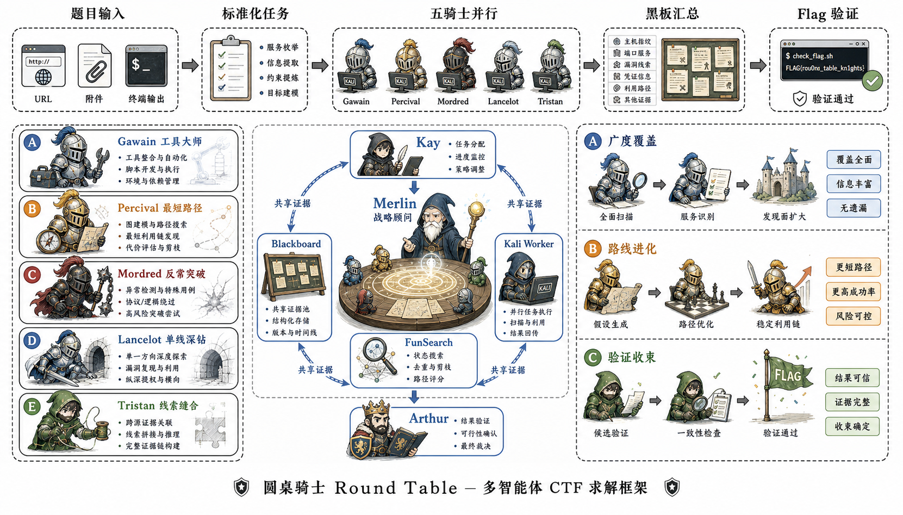
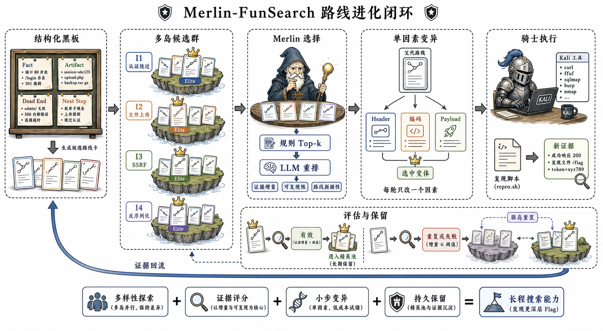
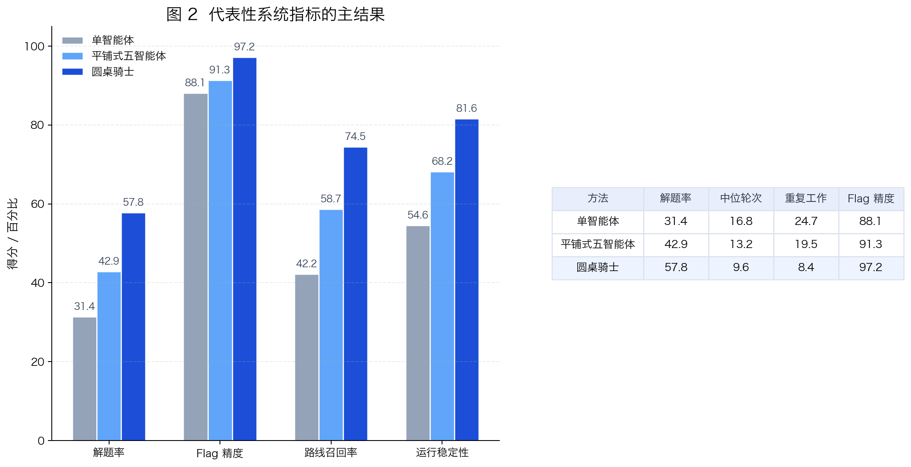
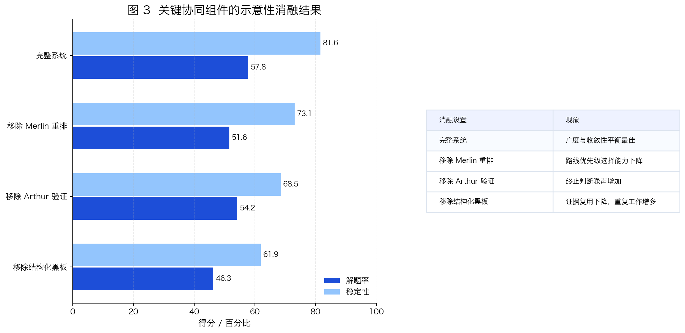

# 圆桌骑士（Round Table）

圆桌骑士是一个面向 CTF 场景的多智能体协作求解系统。它不让多个 agent 进行松散对话，而是把五位“进攻姿态”不同的骑士组织到同一张结构化黑板上，在 `Merlin` 的元控制与 `Arthur` 的结果校验下，持续推进同一道题的解题过程。

系统的目标不是简单堆叠多个模型实例，而是提升长流程题、多阶段题、混合题上的持续搜索能力、路线切换能力与收敛稳定性，同时保持本地工程可复现、可观测、可操作。

## 摘要

现实中的 CTF 题目往往不是一次 payload 即可结束。一个稳定的解题系统通常需要同时具备：

- 广度侦察与快速试探能力，
- 对高价值路线的持续深钻能力，
- 对失败分支的记忆与止损能力，
- 在出现 exploit primitive 后迅速重组利用链的能力，
- 以及对 flag 结果的统一校验与收束能力。

圆桌骑士围绕这些需求，组合了四个核心要素：

- 结构化黑板作为共享证据面，
- 姿态互补的五骑士搜索器，
- 具备 FunSearch 风格路线调度能力的 `Merlin`，
- 以及负责验证与终止的 `Arthur`。

当前版本优先强调工程落地：一条命令构建 worker，一条命令启动 GUI 或命令行任务，并为每道题保留独立工作目录、日志、黑板与骑士笔记。

## 框架结构图

下图参考 `NanoResearch` Figure 2 的论文插图语言重新设计：顶部展示从题目输入到 Flag 验证的统一流程，左侧刻画五种互补的骑士策略，中部呈现 `Kay`、`Merlin`、`Arthur` 与圆桌协同闭环，右侧归纳系统在覆盖、路线进化和验证收束三个层面的目标输出。



## 核心组成

| 组件 | 角色 | 职责 |
| --- | --- | --- |
| `Kay` | 总控编排器 | 启动任务、推进 cycle、管理任务生命周期 |
| `Blackboard` | 共享记忆层 | 记录事实、工件、死路、下一步与候选 flag |
| `Knights` | 搜索执行体 | 按各自姿态推进解题并发布结构化发现 |
| `Merlin` | 元控制器 | 去重、打分、改派、控节奏、管理搜索压力 |
| `Arthur` | 仲裁器 | 校验 flag 候选并控制终止条件 |

## 方法概览

### 1. 黑板优先，而不是群聊优先

系统中的有效发现不会停留在自然语言聊天里，而是会被写成结构化条目。这样做的好处是：

- 证据可以跨 cycle 复用，
- 骑士之间更容易避免重复劳动，
- `Merlin` 可以直接消费这些条目做路线级调度，
- 最终复盘时也能更清晰地还原整条利用链。

### 2. 五骑士按“进攻姿态”分工

圆桌骑士不按题型硬编码分工，而是按搜索风格和策略偏好分工。

| 骑士 | 姿态 | 典型贡献 |
| --- | --- | --- |
| `Gawain` | 工具驱动 | 优先调用 Kali 工具做指纹、协议、探测与快速验证 |
| `Percival` | 最短路径 | 优先尝试出题人更可能预期的低阻力解法 |
| `Mordred` | 反常突破 | 专攻边界输入、畸形用法、非预期路线 |
| `Lancelot` | 单线深钻 | 锁定一条高价值路线持续推进直到证实或证伪 |
| `Tristan` | 线索缝合 | 将零散证据拼接为完整利用链 |

### 3. Merlin 的 FunSearch 风格路线调度

圆桌骑士不是把 FunSearch 用来演化代码片段，而是把它迁移到“攻击路线搜索”上。对系统而言，被保留和迭代的不是程序，而是**策略快照**。

| FunSearch 概念 | 在圆桌中的映射 |
| --- | --- |
| Island | 一类攻击路线，如认证绕过、上传链、SSRF、反序列化 |
| Candidate | 带有黑板证据、脚本与笔记支撑的策略快照 |
| Mutation | 只改一个明确因素，如 header、编码、payload 结构或工具选择 |
| Elite Pool | 每条路线中被保留的高价值候选 |
| Selection | `Merlin` 决定下一轮该把资源投向哪条路线 |

原始 FunSearch 的关键不在于让模型一次给出最优答案，而在于持续维护一组彼此不同的候选，让“生成、评估、选择、变异、保留”形成闭环。圆桌骑士保留了这个思想，但把演化对象从程序片段换成了 CTF 攻击路线。

一次完整的路线进化包含五步：

1. **候选生成**：`Merlin` 从黑板中抽取未被推翻的事实、假设、下一步、工具输出和工件，连同标签与引用关系保存为策略快照，再按标签或条目类型分配路线岛。
2. **多岛维护**：认证绕过、文件上传、SSRF、反序列化等线索被分配到不同 island，每个 island 只保留容量有限的高分 elite，避免一条热门路线吞掉全部搜索预算。
3. **规则选择**：候选分数综合置信度、条目类型、支持与质疑、状态、引用和信息量；随后使用 UCB 在“当前价值”和“探索不足”之间取平衡。
4. **LLM 重排**：规则先产生短名单，Codex 只负责二次语义排序，判断哪条路线更可能带来新资产、稳定利用原语或完整 Flag 链。LLM 失败时会自动退回规则结果，不阻塞骑士运行。
5. **变异与回流**：被选中的 parent 交给合适的骑士，每轮只改变一个因素，例如 Header、编码或 Payload。新证据回写黑板并重新评分；低价值路线被降权，弱岛则可由强岛 elite 重新播种。



因此，`Merlin` 不只是一个调度器，而是一个带持久候选、探索压力与反馈回路的搜索控制器：既能维持路线多样性，也能在出现突破口后持续投入，减少重复尝试和过早收敛。

### 4. Arthur 负责结果校验与收束

`Arthur` 会统一观察 `flag_candidate`、高置信 `artifact` 与关键 `tool_output`。只有当结果足够像合法 flag，或者满足任务终止条件时，整场会议才会真正结束。

## 示意性结果

下列图表仅用于 README 展示系统设计目标与论文风格版式，**不是正式 benchmark 结论**。

### 定性对比

| 系统 | 结构化记忆 | 路线重分配 | 多工具执行 | 人工干预 | 验证式终止 |
| --- | --- | --- | --- | --- | --- |
| 单智能体基线 | 否 | 否 | 部分 | 弱 | 弱 |
| 普通多智能体聊天 | 部分 | 弱 | 部分 | 部分 | 弱 |
| 圆桌骑士 | 是 | 是 | 是 | 是 | 是 |

### 主结果图



### 消融图



## 仓库结构

```text
roundtable/
  benchmark.py      评测平台 API 接入
  assemble.py       组装骑士、Merlin 与 Arthur
  core/             黑板、条目、调度原语
  funsearch/        候选池、聚类、打分、重排
  knights/          骑士策略与 Codex worker 接入
  roles/            Kay、Merlin、Arthur
gui/                本地图形控制台
docker/             Worker 镜像定义
scripts/            构建与启动脚本
examples/           单题与 benchmark 启动入口
tests/              单元与集成测试
```

## 安装

运行前需要准备 Python 3.11+、Docker Desktop，以及已经登录的 Codex CLI 配置。构建脚本会创建包含 Codex、Kali 工具与知识库的共享 worker 镜像。

### 1. 克隆仓库并安装 Python 依赖

```bash
git clone https://github.com/ignite0522/round_table.git
cd round_table
pip install -r requirements.txt
```

### 2. 构建共享 Kali Worker

```bash
./scripts/build_roundtable_kali.sh
```

## 快速启动

### 启动本地 GUI

```bash
python -m gui.app
```

然后打开 [http://127.0.0.1:5055](http://127.0.0.1:5055)。

### 命令行运行单题

```bash
python -m examples.run_ctf \
  "http://target.example/" \
  --cwd ./round_table_work/demo \
  --docker-image roundtable-kali:latest \
  --no-sandbox
```

### 命令行运行 benchmark

```bash
python -m examples.run_benchmark \
  --cwd ./round_table_work/benchmark-runs \
  --docker-image roundtable-kali:latest \
  --no-sandbox
```

## 运行说明

- 每道题都会生成独立工作目录，保存日志、黑板、附件与骑士笔记。
- 多位骑士可以共享同一个 Kali worker，但使用各自独立的工作目录。
- GUI 支持运行中追加人工指令，由系统按最高优先级下发。
- 上面的表格为展示性内容，用于表达系统目标与方法风格，不代表正式评测结果。
