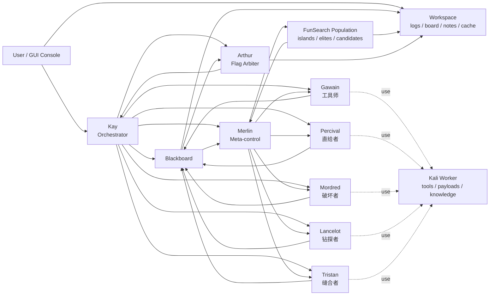

# 圆桌骑士 (Round Table)

一个基于**黑板架构**的多智能体 CTF 协作求解系统。一群"进攻姿态各异"的骑士围坐圆桌,面对**同一道题**,各自从不同角度进攻,把重要发现放上桌,彼此自由接纳(endorse)或质疑(challenge),直到 flag 出现,Arthur 宣布散会。

设计文档见仓库根目录 `DESIGN_圆桌骑士.md`。

## 项目亮点

- **Merlin + FunSearch 调度**: Merlin 不只是做去重和防撞路,还把黑板上的高价值路线组织成 FunSearch 风格的候选池,在多条攻击路线之间做选择、重排和持续推进。
- **黑板式多智能体协作**: 五骑士共享结构化黑板,不是闲聊式多 agent,更利于去重、复盘和把半成品线索滚成完整利用链。
- **Kali Worker 执行环境**: 骑士可以在预装安全工具、知识库和利用脚本的 Kali 容器里工作,把“会推理”落到“真能动手”。
- **本地 GUI 控制台**: 支持批量入队、并发调度、人工追加指令、排队置顶和过程日志回看,方便长时间 benchmark 或多题批量跑。

## 四条设计铁律

1. **黑板是唯一真相源,不是聊天室** —— 骑士只读写结构化条目。
2. **性格 = 策略先验(旋钮),不是角色扮演台词** —— 避免 5 个换皮 LLM。
3. **不按题目类别分工,按进攻姿态分** —— 单题全员同目标。
4. **难点是"卡住怎么办",不是"找到就结束"** —— 这是 Merlin 的价值。

## 架构

| 角色 | 组件 | 职责 |
|---|---|---|
| Kay | Orchestrator | 发牌、驱动主循环、终止判定 |
| 圆桌 | Blackboard | 结构化条目的共享真相源 |
| 5 骑士 | Knight | 按姿态进攻,读写黑板 |
| Merlin | 元认知层 | 去重、死路检测、digest、防撞路、FunSearch 路线调度 |
| Arthur | 仲裁 | 验证 flag,宣布散会 |

**五骑士(进攻姿态)**:Gawain 工具师 · Percival 走正门 · Mordred 逆向出题人 · Lancelot 单线死磕 · Tristan 侧向缝合。

## Framework



## 目录结构

```
roundtable/
  core/        黑板、条目类型、工具接口、digest
  knights/     KnightPolicy 旋钮 + 五骑士配置 + 骑士实现(mock / Codex)
  roles/       Kay / Merlin / Arthur
  sandbox/     沙箱工具(Phase 2+)
tests/         单元测试与协作机制验证
examples/      端到端演示题目
```

## 关键机制

- **Merlin 元认知层**: 负责去重、死路检测、收束、改派任务、目标范围裁决。
- **FunSearch 风格搜索控制**: 将高价值发现组织成候选路线,维护精英池,并对下一轮最值得扩展的路线做选择与重排。
- **Arthur 仲裁**: 负责把 flag_candidate、artifact、tool_output 中的高置信旗子统一校验,避免“幻觉命中”直接结束会议。
- **共享/持久状态**: 黑板、日志、任务记录、本地已解缓存都会落盘,适合长任务和 benchmark 续跑。

## Merlin + FunSearch 详细说明

### 它解决的不是“会不会推理”,而是“长期搜索怎么管”

很多多智能体系统在短题上看起来很热闹,但长题里会出现这些问题:

- 多个 agent 重复打一类相近路线
- 某条路线一时火热,吞掉全部注意力
- 暂时较弱但未来可能关键的路线被遗忘
- 失败经验只进日志,不会反过来影响下一轮搜索

这个项目把 **Merlin** 放在全局调度层,再让 Merlin 使用 **FunSearch 风格的搜索控制**,目的就是解决这些问题。

### 在这个项目里,FunSearch 不是解题器,而是搜索控制层

原始 FunSearch 的核心思想不是“让模型一次想到最优答案”,而是:

1. 保留多个候选路线
2. 每次从其中一条继续做小步变异
3. 对每个新候选做统一评估
4. 保留表现好的,淘汰低价值的
5. 防止搜索只会盯住当前最热的一条线

在 Round Table 里,对应关系大致是:

| FunSearch 概念 | Round Table 对应物 |
|---|---|
| island | 一条逻辑上的攻击路线或线索簇 |
| candidate | 某条路线当前可继续扩展的完整快照 |
| parent | 当前路线里已验证、值得继续改的候选 |
| mutation | 下一轮只改变一个明确因素 |
| evaluator | Merlin 的规则打分 + 黑板反馈 + Arthur 校验 |
| elite pool | 每条路线保留的高价值候选集合 |

也就是说,这里进化的不是单独一段代码,而是**攻击路线本身**。

### island 在 CTF 里是什么意思

island 不是线程,不是容器,也不是固定角色。

它更像是“同一道题里的一个方向”,比如:

- 登录绕过
- 文件上传
- 反序列化
- 附件逆向
- 本地服务 pivot
- 静态资源泄露
- 协议误用

每条路线都会留下自己的候选历史。这样就算某条路线暂时不热,也不会立刻从系统记忆里消失。

### candidate 具体记录什么

在这个项目里,一个 candidate 不是一句自然语言想法,而是一份能继续扩展的完整快照。通常会关联:

- 黑板条目 id
- 标题、正文、标签、引用关系
- 当前路线得分
- 对应 island
- 是否进入 elite pool
- 后续被选择次数
- 工作目录里的策略快照与结果文件

相关实现见:

- [roundtable/funsearch/merlin_control.py](/Users/guyuwei/Documents/ai/CodexResearch/round_table/roundtable/funsearch/merlin_control.py)
- [roundtable/funsearch/population.py](/Users/guyuwei/Documents/ai/CodexResearch/round_table/roundtable/funsearch/population.py)

### Merlin 如何实际使用 FunSearch

Merlin 每轮会做这些事情:

1. 扫描本轮黑板新增的高价值条目
2. 把符合条件的条目注册进 FunSearch population
3. 将不同标签/类型的路线归入不同 island
4. 从 population 中选出下一条最值得扩展的路线
5. 把这条路线转成对某位骑士的具体 directive
6. 等骑士新结果回桌后,再次记录并打分

所以 Merlin 的职责不只是“看一眼黑板”,而是:

- 管路线
- 管搜索节奏
- 管证据沉淀
- 管下一轮注意力投向哪里

### 为什么强调“小步变异”

FunSearch 最重要的经验之一是: **一次只改一个明确因素**。

例如某条路线当前状态是:

- 已发现 `/setup/status`
- 已确认未鉴权读取
- 正在尝试 POST 写接口

那么更合理的下一轮变异是:

- 只改请求方法
- 只改 `Content-Type`
- 只改 body 结构
- 只改 header 组合
- 只换一种 Kali 工具复现

而不是同时改 endpoint、payload、header 和代理方式。

这样一旦结果变好或变差,系统才知道究竟是哪一个因素带来了变化。

### 评分为什么重要

当前项目里的 FunSearch 不是黑箱排序,而是偏工程化的规则评分。候选分数会综合考虑:

- 条目类型
- 置信度
- endorse / challenge
- 引用关系与正文信息量
- 是否是 artifact / tool_output / flag_candidate
- 是否被标记为 dead_end 或 refuted

这会让 Merlin 更偏向选择真实产生新证据和可复现价值的路线,而不是只会“说得像对”的路线。

### LLM 在这套 FunSearch 里扮演什么角色

这里的 LLM 不是唯一评估器,而是一个可选的辅助重排器。

项目当前思路是:

1. 规则先筛出 shortlist
2. Merlin 再可选地调用 Codex 做二次 rerank

这样既保留了稳定、可控的主体逻辑,也保留了语义层面的柔性判断能力。

### 为什么这是这个项目的亮点

这套设计真正特别的地方在于:

- 骑士负责“动手”
- 黑板负责“记忆”
- Arthur 负责“验旗”
- **Merlin + FunSearch 负责“长期搜索控制”**

所以它不是普通的“5 个 agent 一起跑”,而是:

**一个带有持久路线记忆、候选保留、重排和收束能力的 CTF 搜索系统。**

## 开发阶段

- **Phase 1**(当前):黑板 + 协议 + 脚本模拟骑士(无 LLM 即可验证协作骨架)
- **Phase 2**:Kay 主循环 + Arthur + 接入 Codex CLI 真骑士 + 沙箱
- **Phase 3**:Merlin 元认知(去重/死路/收束)
- **Phase 4**:加固(沙箱隔离、预算、姿态池化、复盘报告)

## 快速开始(Phase 1,无需 LLM / API Key)

```bash
cd round_table
python -m pytest tests/ -v          # 跑协作机制测试
python -m examples.demo_base64      # 脚本模拟骑士端到端跑通一道简单题
```

## Kali Worker(第一版)

当前仓库提供了一版自建的 `Kali-lite` worker 镜像定义,目标是给圆桌骑士提供一个
预装常用 CTF/Web 安全工具的容器工位,同时保留项目代码在宿主机、运行时挂载进容器。

### 已安装工具

- 通用:`curl` `jq` `ripgrep` `fd` `git` `python3` `pip` `nodejs` `npm`
- Web/CTF:`nmap` `naabu` `sqlmap` `nikto` `dirsearch` `ffuf` `gobuster` `feroxbuster` `wfuzz`
- 其他:`netcat` `ncat` `binwalk` `exiftool` `xxd`
- Agent CLI:`codex`

注意: Dockerfile 里会在构建阶段移除 `nmap` 二进制的 file capabilities,避免它在 `NoNewPrivs` 一类容器限制下直接起不来。重建镜像后,`nmap` 应可作为普通用户态工具使用; 涉及原始套接字/特权扫描能力时仍可能受限。端口/服务侦察依然推荐优先配合 `naabu`、`ncat`、`nc`、`curl`、`openssl s_client`、`httpx`、`whatweb`。

### 构建镜像

```bash
./scripts/build_roundtable_kali.sh
```

如需自定义 tag:

```bash
./scripts/build_roundtable_kali.sh roundtable-kali:dev
```

### 进入容器

下面命令会:

- 把仓库挂载到容器内 `/opt/roundtable`
- 把工作目录挂载到容器内 `/workspace`
- 把宿主机 `CODEX_HOME` 或默认 `~/.codex` 只读挂载到 `/host-codex-home`
- 首次启动时把 `auth.json` 复制进容器用户自己的 `~/.codex`

```bash
./scripts/run_roundtable_kali.sh
```

指定工作目录:

```bash
./scripts/run_roundtable_kali.sh ./round_table_work/run-demo bash
```

进容器后,你可以直接验证工具和 Codex:

```bash
codex --version
naabu -version
ffuf -V
```
